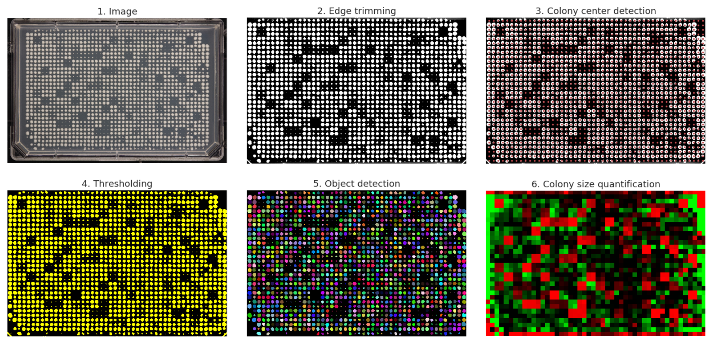

INTRODUCTION
============

Platometer is a simple image-processing tool for quantifying colony sizes from arrayed growth experiments in yeast or bacteria. Typical applications include phenotypic screens of mutant collections and synthetic genetic array (SGA) experiments.




**WARNING. This package is still in development. Please use caution.**


GETTING STARTED
===============

Platometer requires Python 3 and a set of packages listed in `requirements.txt`. We recommend setting up a virtual environment and installing all the required packages via pip:

```
cd platometer/
virtualenv -p python3.6 platometer_env
source platometer_env/bin/activate
pip install -r requirements.txt
```

After the installation is complete, it is useful to run a "hello world" Platometer analysis using the Jupyter notebook at `examples/Usage_examples.ipynb`. 

To do so, from within the platometer_env environment install a new ipython kernel:

```
ipython kernel install --user --name=platometer
```

Then start jupyter, open `examples/Usage_examples.ipynb` and select the platometer_env kernel.

```
jupyter-notebook
```

For command line useage see `platometer.py`. Platometer takes four arguments:

```
python [--plate_format plate_format ] [--chunk_size chunk_size] [--nr_processes nr_processes] path_to_jpg_list
```
- positional arguments:
  - path_to_jpg_list:      Path to the file containing the list of jpgs to
                        process

- optional arguments:
  - --plate_format:    Expected plate format (default=32 48)
  - --chunk_size:
                        Number of images per chunk (default=100)
  - --nr_processes:
                        Number of cores to use (default: all available)

The paths to your JPG images should be formated one image path per, see `examples/folders_to_process.txt` for details.


When ready run an example case:

```
python platometer.py examples/folders_to_process.txt
```

Platometer has two main outputs: 

- jpg_map.p: pickle file with two headers, file_id and path to image 
- all_data.p: pickle file with colony size quanification for each colony (row,coumn) position on the plate. 

These files can be merged for more information see `examples/Usage_examples.ipynb`

HELP
====

Please direct all questions/comments to Anastasia Baryshnikova (<abaryshnikova@calicolabs.com>).

The main repository for this code is at <https://github.com/baryshnikova-lab/platometer>. Please subscribe to the repository to receive live updates about new code releases and bug reports.
